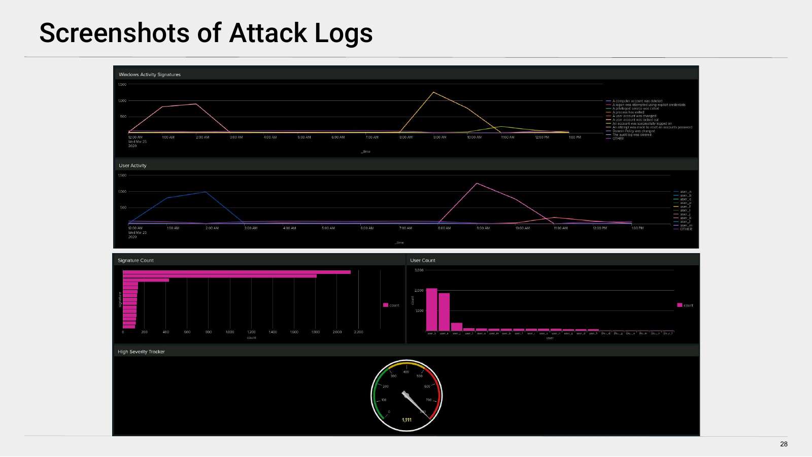
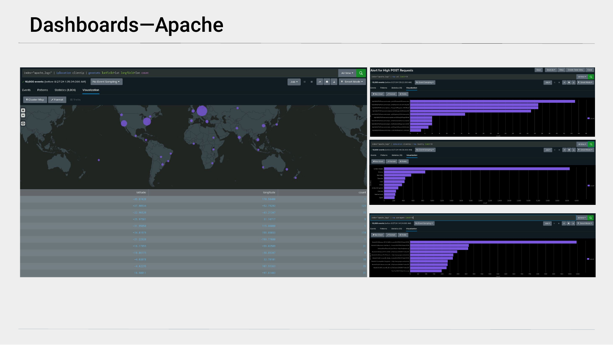

# VSI Splunk SIEM

Custom SIEM built in Splunk for a fictional company (Virtual Space Industries). Team of three acting as SOC analysts, UofT cybersecurity program (2024).

## The Setup

We ingested historical logs from a Windows Server and an Apache web server into Splunk, established baselines, then built reports, alerts, and dashboards. Simulated attack logs were then loaded so we could check whether our detection rules caught the activity.

## What We Built

- **Baseline reports** — established normal traffic patterns first (login volume, HTTP methods, response codes, geographic distribution) so an anomaly would stand out against a known-good picture
- **Threshold alerts** — hourly rules for failed Windows activity (baseline ~30, fires at 50), successful-login spikes (baseline ~40, fires at 80), and Windows account deletions (baseline ~40, fires at 50 after tuning). On the Apache side, an HTTP POST volume alert (baseline 2–6/hr, fires at 30/hr) and a non-US traffic alert (baseline ~30/hr, fires at 50/hr)
- **Monitoring dashboards** — panels for Windows activity signatures and per-user activity over time, a signature/user count breakdown, a high-severity gauge, and a geographic cluster map of Apache request origins

## Splunk Dashboards

**Windows Server Monitoring during the simulated attack.** The activity-signature and per-user panels show two clear spikes: account lockouts around 1–3 AM and password-reset attempts around 9–11 AM, driven mainly by `user_a` and `user_k`. The high-severity gauge reads 1,111 events.



**Apache traffic dashboard.** A geostats cluster map of request origins alongside high-POST-request, top-country, and top-user-agent breakdowns.



## SPL Detection Logic

The report documents each alert by name, description, baseline, and threshold. The Apache queries below are transcribed from the Splunk search bars shown in the report; the Windows queries are labeled where the report describes the rule in words but does not print the SPL.

**Apache — HTTP POST volume** *(transcribed from the report, p. 32)*. Tracks POST request rate per hour; the simulated attack pushed this to roughly 1,500 at 8 PM against a 2–6/hr baseline.

```spl
index="apache_logs" method=POST | timechart span=1h count
```

**Apache — non-US traffic** *(transcribed from the report, p. 20)*. Geolocates client IPs and counts requests from outside the United States, which surfaced a spike from Ukraine during the attack.

```spl
index="apache_logs" | iplocation clientip | search Country!="United States" | stats count by _time, Country
```

**Windows — failed-activity / brute-force** *(representative rule logic, reconstructed from the report's described alert; the report specifies an hourly failed-activity count with a threshold of 50 but does not print the SPL)*.

```spl
index=windows_server_logs signature="*failure*"
| bucket _time span=1h
| stats count AS failed_activity by _time
| where failed_activity > 50
```

**Windows — successful-login spike** *(representative rule logic, reconstructed from the report's described alert; hourly successful-login count, threshold 80)*.

```spl
index=windows_server_logs signature="An account was successfully logged on"
| bucket _time span=1h
| stats count AS logins by _time
| where logins > 80
```

**Windows — account deletion** *(representative rule logic, reconstructed from the report's described alert; hourly deletion count, threshold tuned to 50)*.

```spl
index=windows_server_logs signature="A user account was deleted"
| bucket _time span=1h
| stats count AS deletions by _time
| where deletions > 50
```

## What We Caught

The failed-activity alert fired during the account-lockout and password-reset windows, where hourly counts ran well past the threshold. The Apache POST alert fired correctly on the 8 PM surge, and the non-US alert flagged the Ukraine spike. The account-deletion alert did not trip at its original threshold of 60, so we tuned it down to 50. We also noted that the login page (`/VSI_Account_logon.php`) jumped from 128 to 1,323 accesses during the attack, consistent with a targeted brute-force attempt.

## Tools

Splunk Enterprise, Splunk Windows Security Operations Center (INFIGO add-on), Windows Server logs, Apache access logs

## Report

Full SIEM implementation report with dashboard screenshots, alert thresholds, and attack analysis: **[SIEM Implementation Report (PDF)](SIEM_Implementation_Report.pdf)**

## Related

This is the detection side of the same coursework. For the offensive counterpart, a red-team engagement against an intentionally vulnerable environment, see **[rekall-penetration-testing](https://github.com/tylerbcrawford/rekall-penetration-testing)**.

## Context

SOC analyst simulation project for UofT's cybersecurity certificate program.
